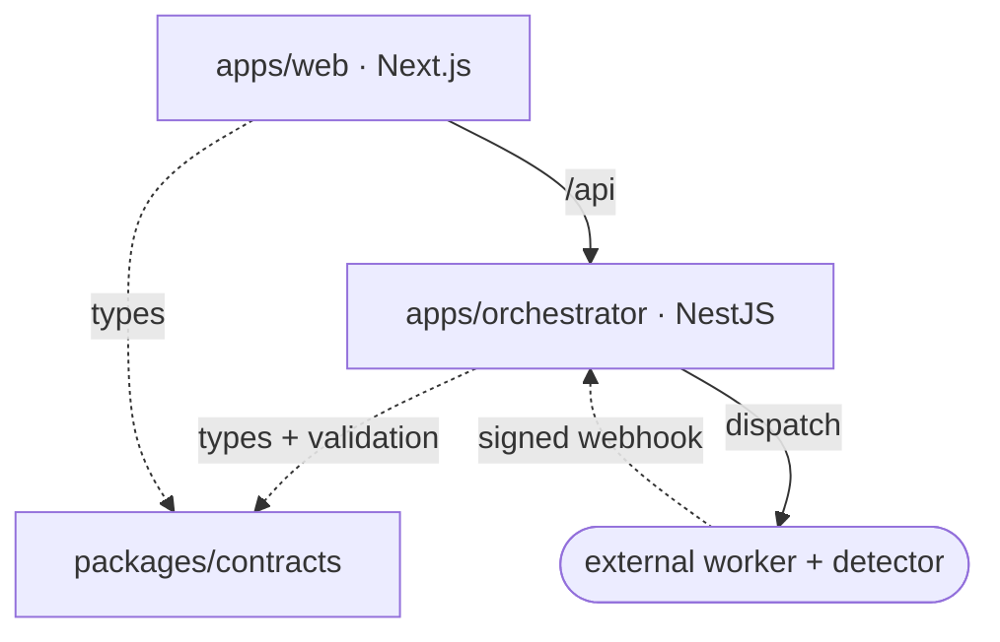

# Auto Estimator Platform

> Turn large electrical‑drawing PDFs into a **reviewed, priced electrical estimate**.

A contractor uploads a set of electrical drawings. An AI worker extracts the panel
schedules and detects electrical symbols; a human reviews and corrects them; the
platform prices the result against a catalog and exports it as JSON or CSV. The whole
flow runs **end‑to‑end locally with mocked AI** — no Docker, cloud, or GPU required.


The AI pipeline lives in a separate **worker** repo
(`/home/jerov/workspace/construction`). This repository is the *product and
infrastructure shell* around it.

---

## What's in here

| Path | Package | Description |
|---|---|---|
| `apps/orchestrator` | NestJS API | The core — owns data, dispatch, ingestion, exports |
| `apps/web` | Next.js 15 / React 19 | Operational review & upload UI |
| `packages/contracts` | Zod schemas | Shared worker/detector contracts + types |
| `services/detector` | FastAPI | Grounded‑SAM‑shaped detector (mock) |
| `infra/terraform` | Terraform | AWS deployment skeleton |



---

## Quick start (no‑Docker local mode) 🧪

Build everything, then run the API with the proven local mode (SQL.js + local
storage + mock worker):

```bash
COREPACK_HOME=/tmp/corepack corepack pnpm install
COREPACK_HOME=/tmp/corepack corepack pnpm -r build

DB_TYPE=sqljs \
STORAGE_MODE=local \
WORKER_MODE=mock \
SQLJS_DB_PATH=/tmp/auto-estimator-platform.sqlite \
LOCAL_STORAGE_DIR=/tmp/auto-estimator-storage \
PORT=4000 \
JWT_SECRET=local-dev \
node apps/orchestrator/dist/main.js
```

Run the web app against it:

```bash
NEXT_PUBLIC_API_URL=http://localhost:4000/api \
COREPACK_HOME=/tmp/corepack \
corepack pnpm --filter @auto-estimator/web start
# open http://localhost:3000/projects
```

Health check: `curl http://localhost:4000/api/health` → `{"ok":true,"service":"orchestrator"}`.

> For Docker‑based local dev (Postgres + LocalStack + detector) and the full smoke
> test, see [docs/LOCAL_DEVELOPMENT.md](docs/LOCAL_DEVELOPMENT.md).

---

## Documentation

📚 **Start at the documentation hub: [docs/README.md](docs/README.md).**

| Topic | Doc |
|---|---|
| Why it exists, what's real vs mocked | [docs/PROJECT_CONTEXT.md](docs/PROJECT_CONTEXT.md) |
| Architecture, diagrams, lifecycles | [docs/ARCHITECTURE.md](docs/ARCHITECTURE.md) |
| Build & run locally | [docs/LOCAL_DEVELOPMENT.md](docs/LOCAL_DEVELOPMENT.md) |
| Environment & run modes | [docs/CONFIGURATION.md](docs/CONFIGURATION.md) |
| Backend reference | [docs/ORCHESTRATOR.md](docs/ORCHESTRATOR.md) |
| Frontend reference | [docs/WEB.md](docs/WEB.md) |
| Data model (ERD) | [docs/DATA_MODEL.md](docs/DATA_MODEL.md) |
| HTTP API | [docs/API_REFERENCE.md](docs/API_REFERENCE.md) |
| Worker/detector contracts | [docs/CONTRACTS.md](docs/CONTRACTS.md) |
| Detector service | [docs/DETECTOR.md](docs/DETECTOR.md) |
| Infrastructure | [docs/INFRASTRUCTURE.md](docs/INFRASTRUCTURE.md) |
| Glossary | [docs/GLOSSARY.md](docs/GLOSSARY.md) |
| Code review & roadmap | [docs/CODE_REVIEW.md](docs/CODE_REVIEW.md) · [docs/NEXT_STEPS.md](docs/NEXT_STEPS.md) |

---

## Worker integration

The orchestrator sends the worker this payload (field names are a stable contract):

```json
{
  "project_id": "project-id",
  "s3_key": "projects/project-id/file.pdf",
  "callback_url": "http://localhost:4000/api/worker/webhooks/pipeline-completed",
  "unit_prices": {}
}
```

The worker posts results back to `POST /api/worker/webhooks/pipeline-completed` with
`X-Auto-Estimator-Signature: sha256=<hmac>` when webhook signing is enabled. Full
shapes in [docs/CONTRACTS.md](docs/CONTRACTS.md).

---

## Repository conventions

- **Monorepo** managed with `pnpm` workspaces (`apps/*`, `packages/*`).
- **TypeORM**, not Prisma. Portable column types keep SQL.js local mode working.
- Keep `WORKER_MODE=mock` local behaviour intact — it's the no‑Docker dev path.
- See [AGENTS.md](AGENTS.md) for the rules that govern changes to this workspace.
