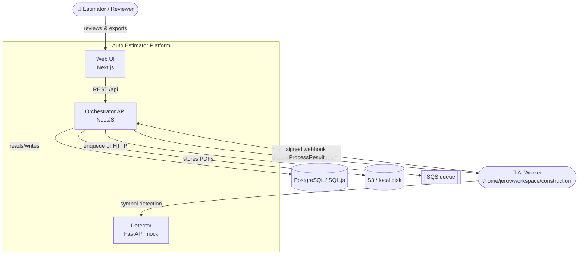
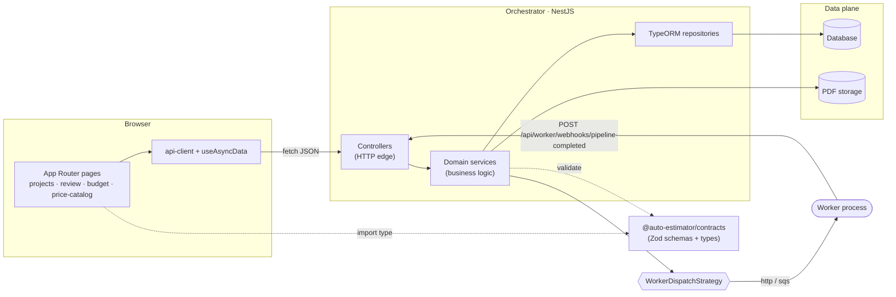
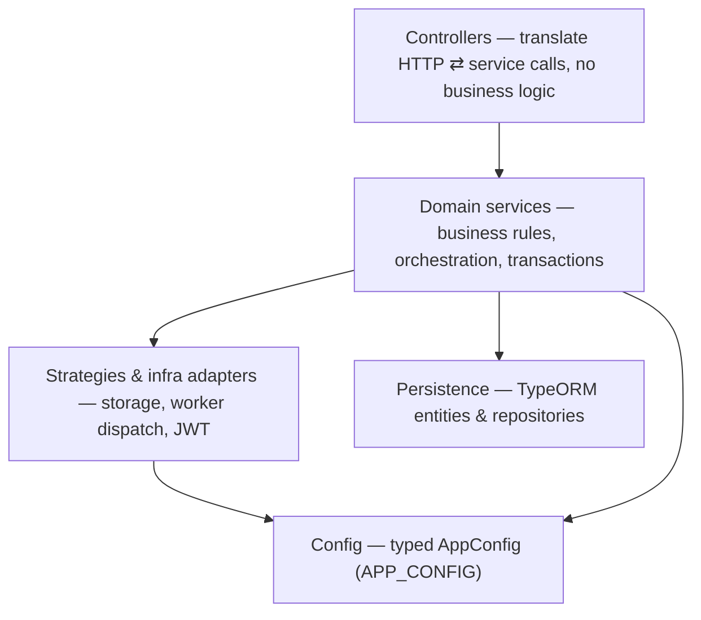
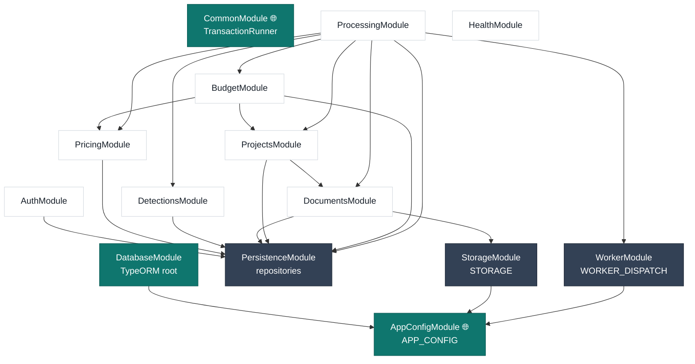
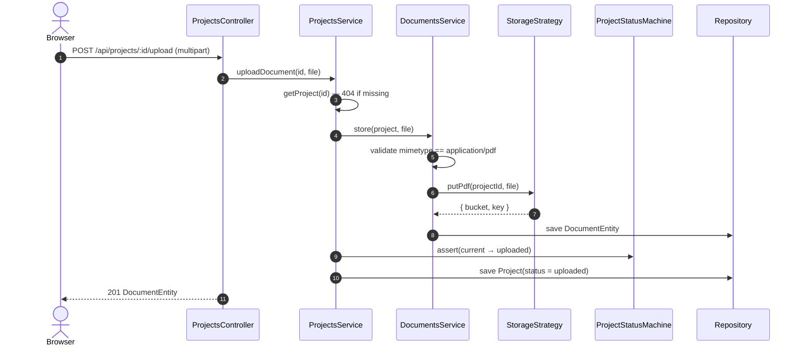
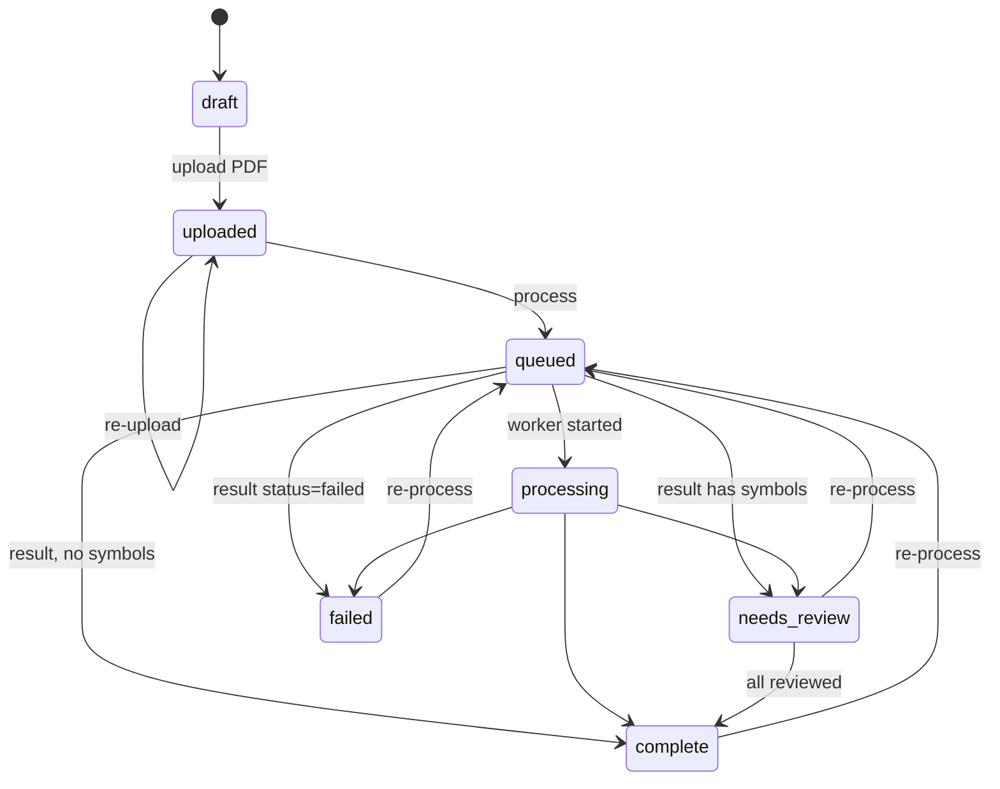
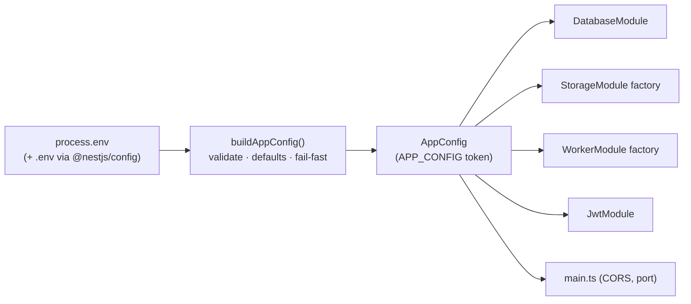
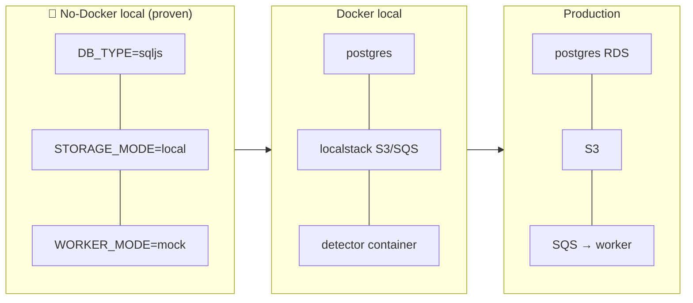
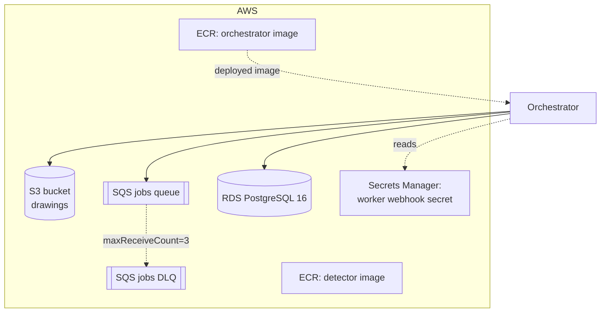

# Architecture

A tour of how the Auto Estimator Platform is put together — from the systems that
talk to each other, down to the NestJS modules inside the orchestrator and the
lifecycles that move a project from *upload* to *exported estimate*.

> New to the project? Read [PROJECT_CONTEXT.md](PROJECT_CONTEXT.md) first, then this
> page. For the per-module reference, continue to [ORCHESTRATOR.md](ORCHESTRATOR.md)
> and [WEB.md](WEB.md).

---

## Contents

1. [Design principles](#design-principles)
2. [System context](#system-context)
3. [Containers & components](#containers--components)
4. [Orchestrator module graph](#orchestrator-module-graph)
5. [Layered request flow](#layered-request-flow)
6. [The processing lifecycle](#the-processing-lifecycle)
7. [Project status state machine](#project-status-state-machine)
8. [Configuration & run modes](#configuration--run-modes)
9. [Deployment topology](#deployment-topology)
10. [Cross-cutting concerns](#cross-cutting-concerns)

---

## Design principles

The codebase was refactored to follow a small set of explicit rules. Keep them in
mind when extending it.

| Principle | How it shows up |
|---|---|
| **Single responsibility** | Each domain (projects, documents, detections, budget, pricing, processing, auth) is its own NestJS module with focused services. No "god service." |
| **Open/closed via strategies** | Storage (local/S3) and worker dispatch (mock/http/sqs) are interfaces with interchangeable implementations chosen by a factory provider — adding a backend never edits a consumer. |
| **Dependency inversion** | Controllers depend on services; services hide persistence. Infrastructure clients are injected by token (`STORAGE`, `WORKER_DISPATCH`), never `new`'d inline. |
| **Fail fast & typed config** | Environment is read **once**, validated, and exposed as a typed object (`APP_CONFIG`). Production refuses to boot without required secrets. |
| **Atomic writes** | Multi-table ingestion and budget recalculation run inside a single transaction. |
| **Explicit state** | Project status transitions go through a state machine, not scattered assignments. |
| **Shared contracts** | One Zod source of truth (`packages/contracts`) validates the worker boundary for both the orchestrator and the worker. |

---

## System context

Who and what interacts with the platform.



- **Estimator/Reviewer** — the human who uploads drawings and corrects detections.
- **AI Worker** — external; reads the PDF, extracts schedules, detects symbols, prices, and posts results back. Owns the heavy AI lifting.
- **Detector** — a Grounded‑SAM‑shaped HTTP service. In this repo it is a deterministic mock; the worker calls it during detection.

---

## Containers & components

A closer look at what runs where and how data moves between processes.



**Layers inside the orchestrator** (dependencies point downward only):



---

## Orchestrator module graph

The orchestrator is composed of **global** modules (config, common helpers,
database) and **feature** modules. Edges are NestJS `imports`; the graph is acyclic.



> 💡 `AppConfigModule`, `CommonModule`, and the database connection are global, so
> feature modules inject `APP_CONFIG`, `TransactionRunner`, and repositories without
> importing them explicitly. `ProcessingModule` is the application-service hub that
> coordinates the others; nothing imports it back, so there are no cycles.

| Module | Owns | Key provider(s) | Reference |
|---|---|---|---|
| `AppConfigModule` | validated configuration | `APP_CONFIG` | [CONFIGURATION.md](CONFIGURATION.md) |
| `CommonModule` | transactions, validators | `TransactionRunner` | [ORCHESTRATOR.md](ORCHESTRATOR.md#common) |
| `DatabaseModule` / `PersistenceModule` | connection + repositories | TypeORM | [DATA_MODEL.md](DATA_MODEL.md) |
| `StorageModule` | PDF persistence | `StorageStrategy` | [ORCHESTRATOR.md](ORCHESTRATOR.md#storage) |
| `WorkerModule` | job dispatch | `WorkerDispatchStrategy` | [ORCHESTRATOR.md](ORCHESTRATOR.md#worker-dispatch) |
| `AuthModule` | users, JWT, guard | `AuthService`, `JwtAuthGuard` | [ORCHESTRATOR.md](ORCHESTRATOR.md#auth) |
| `ProjectsModule` | project CRUD + lifecycle | `ProjectsService`, `ProjectStatusMachine` | [ORCHESTRATOR.md](ORCHESTRATOR.md#projects) |
| `DocumentsModule` | uploads | `DocumentsService` | [ORCHESTRATOR.md](ORCHESTRATOR.md#documents) |
| `DetectionsModule` | review of detections | `DetectionsService` | [ORCHESTRATOR.md](ORCHESTRATOR.md#detections) |
| `BudgetModule` | pricing roll-up + export | `BudgetService`, `ExportService` | [ORCHESTRATOR.md](ORCHESTRATOR.md#budget) |
| `PricingModule` | price catalog | `PricingService` | [ORCHESTRATOR.md](ORCHESTRATOR.md#pricing) |
| `ProcessingModule` | dispatch + result ingestion | `ProcessingService` | [ORCHESTRATOR.md](ORCHESTRATOR.md#processing) |

---

## Layered request flow

A read/write request that does **not** involve the worker — e.g. uploading a PDF.



---

## The processing lifecycle

The heart of the platform. `POST /process` builds a `ProcessRequest`, records a
`ProcessingJob`, and dispatches via the configured strategy. How the result comes
back depends on the mode.

### Dispatch (all modes)

```mermaid
sequenceDiagram
    autonumber
    actor U as Browser
    participant PC as ProcessingController
    participant PS as ProcessingService
    participant PR as PricingService
    participant WD as WorkerDispatchStrategy
    U->>PC: POST /api/projects/:id/process
    PC->>PS: startProcessing(id)
    PS->>PS: getProject + find latest document
    PS->>PR: getPriceMap() → unit_prices
    PS->>PS: build & validate ProcessRequest (Zod)
    PS->>PS: save ProcessingJob(queued); project → queued
    PS->>WD: dispatch(payload)
    alt mock (synchronous)
        WD-->>PS: { mode:"mock", result }
        PS->>PS: applyWorkerResult(result)
    else http / sqs (result arrives later via webhook)
        WD-->>PS: { mode:"http" or "sqs" }
    end
    PC-->>U: ProcessingJob
```

### Result ingestion — one atomic transaction

Whether the result arrives synchronously (mock) or via the webhook
(`POST /api/worker/webhooks/pipeline-completed`), it funnels into
`ProcessingService.applyWorkerResult`, which is **idempotent** and **transactional**.

```mermaid
sequenceDiagram
    autonumber
    participant K as Worker / Mock
    participant WC as WebhookController
    participant PS as ProcessingService
    participant TX as TransactionRunner
    participant DB as EntityManager (txn)

    K->>WC: POST pipeline-completed (event + HMAC signature)
    WC->>WC: verify event + HMAC (timing-safe)
    WC->>PS: applyWorkerResult(body)
    PS->>PS: validate with ProcessResultSchema (Zod)
    PS->>DB: existing WebhookEvent(projectId,event)?
    alt duplicate (no-op)
        PS-->>WC: { duplicate:true }
    else first delivery
        PS->>PS: derive next ProjectStatus; assert transition
        PS->>TX: run(manager ⇒ …)
        TX->>DB: save WebhookEvent (idempotency marker)
        TX->>DB: save WorkerResult (raw archive)
        TX->>DB: replace PanelSchedules
        TX->>DB: replace DetectedSymbols
        alt worker provided a budget
            TX->>DB: persist worker budget verbatim
        else
            TX->>DB: recalc budget from detections × prices
        end
        TX->>DB: update Project + ProcessingJob status
        PS-->>WC: { duplicate:false }
    end
```

> ⚠️ **Idempotency.** The unique `(projectId, event)` index on `WebhookEvent` makes
> redelivery safe: a second `pipeline.completed` for the same project is a no-op.
> 🧪 In `WORKER_MODE=mock` the webhook is bypassed — `applyWorkerResult` is called
> directly with the mock result, so the same ingestion path is exercised.

---

## Project status state machine

`ProjectStatus` transitions are validated centrally by `ProjectStatusMachine`
(`projects/project-status.machine.ts`). Re-uploading and re-processing are allowed
from terminal states so a run can be retried.



The related `ProcessingJob` status (`queued → processing → completed | needs_review | failed`)
is derived from the same result in the same transaction.

---

## Configuration & run modes

`process.env` is read in exactly one place — `config/configuration.ts` —
validated, and frozen into the typed `AppConfig` object behind `APP_CONFIG`.



The platform runs in layered modes so the full product flow works with zero external
dependencies, then progressively wires real infrastructure. See
[CONFIGURATION.md](CONFIGURATION.md) for every variable.

| Concern | Variable | Modes |
|---|---|---|
| **Worker dispatch** | `WORKER_MODE` | `mock` (sync, local) · `http` (`WORKER_HTTP_URL`) · `sqs` (`SQS_QUEUE_URL`) |
| **PDF storage** | `STORAGE_MODE` | `local` (`LOCAL_STORAGE_DIR`) · `s3` (`S3_BUCKET`, optional `S3_ENDPOINT`) |
| **Database** | `DB_TYPE` | `sqljs` (`SQLJS_DB_PATH`) · `postgres` (`DATABASE_URL`) |
| **Auth enforcement** | `AUTH_ENFORCE` | `false` (default; guard installed but off) · `true` |



---

## Deployment topology

The Terraform skeleton (`infra/terraform`) describes the intended AWS shape. It is a
**skeleton** — see [INFRASTRUCTURE.md](INFRASTRUCTURE.md) for what exists vs. what is
still to do.



For local Docker development, `docker-compose.yml` provides `postgres:16`,
`localstack` (S3 + SQS), and the `detector` container.

---

## Cross-cutting concerns

| Concern | Where it lives | Notes |
|---|---|---|
| **Validation** | `common/validation.ts` + Zod contracts | API bodies validated by hand-rolled helpers; the worker boundary uses `ProcessRequestSchema` / `ProcessResultSchema`. |
| **Transactions** | `common/transaction.runner.ts` | `TransactionRunner.run(manager ⇒ …)` wraps multi-table writes. |
| **Auth** | `auth/` | `JwtAuthGuard`, `AuthEnforcementGuard`, `@Public()`, and `@CurrentUser()`. `GET /me` is always guarded; all non-public routes require Bearer auth when `AUTH_ENFORCE=true`. |
| **Webhook security** | `processing/webhook.controller.ts` | Event check + timing-safe HMAC over the raw body when `WORKER_WEBHOOK_SECRET` is set. |
| **Logging** | NestJS `Logger` | Dispatch, ingestion, and duplicate-webhook events are logged in `ProcessingService`. |
| **Errors** | NestJS HTTP exceptions | `BadRequest`/`NotFound`/`Unauthorized`/`ServiceUnavailable` — no bare `throw new Error` in request paths. |

Continue to **[ORCHESTRATOR.md](ORCHESTRATOR.md)** for the module-by-module reference.
