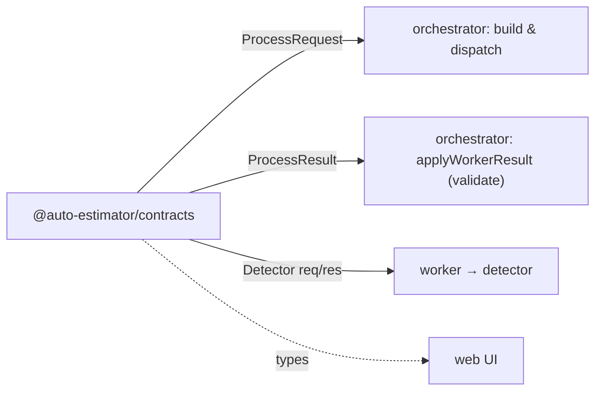
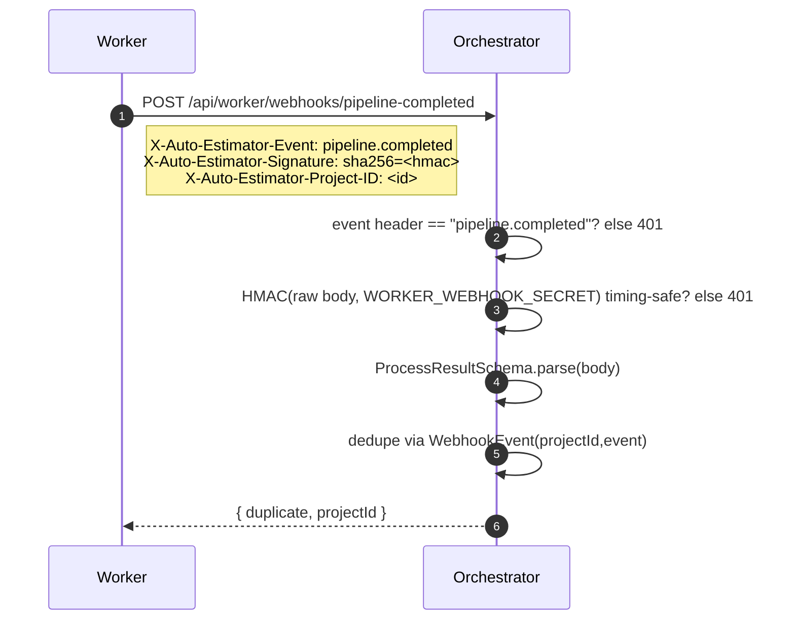

# Contracts

The integration contracts between the platform and the AI worker / detector. These
are the **shared boundary**: change them only in lock-step with the worker.

All schemas are defined once, with Zod, in:

```text
packages/contracts/src/index.ts
```

…and mirror the worker's Python/Pydantic models. Both the web app and the
orchestrator import the inferred TypeScript types from `@auto-estimator/contracts`;
the orchestrator additionally uses the Zod schemas to **validate** worker payloads at
runtime.

> ⚠️ **Field-name stability.** Never rename `project_id`, `s3_key`, `callback_url`, or
> `unit_prices`. They are the wire contract with the worker in
> `/home/jerov/workspace/construction`.

---

## Where each contract is used



---

## Worker request

The **`ProcessRequest`** sent by the orchestrator to the worker when processing starts.

| Field | Type | Rules | Meaning |
|---|---|---|---|
| `project_id` | string | non-empty | the project being processed |
| `s3_key` | string | non-empty | storage key of the uploaded PDF |
| `callback_url` | string \| null | URL, optional | where to POST the result webhook |
| `unit_prices` | `Record<string, number>` | values ≥ 0, default `{}` | label → unit price snapshot |

```json
{
  "project_id": "uuid",
  "s3_key": "projects/uuid/file.pdf",
  "callback_url": "http://localhost:4000/api/worker/webhooks/pipeline-completed",
  "unit_prices": { "duplex receptacle": 85, "luminaire": 140 }
}
```

---

## Worker result

The **`ProcessResult`** posted back by the worker (or generated by the mock). Ingested by
`ProcessingService.applyWorkerResult` after `ProcessResultSchema` validation.

| Field | Type | Default | Meaning |
|---|---|---|---|
| `project_id` | string | — | target project |
| `status` | `JobStatus` | — | `queued` · `processing` · `completed` · `needs_review` · `failed` |
| `schedules` | `PanelSchedule[]` | `[]` | extracted schedule tables |
| `symbols` | `DetectedSymbol[]` | `[]` | detected symbols |
| `budget` | `Budget \| null` | `null` | worker-computed budget, if any |
| `errors` | `string[]` | `[]` | hard errors |
| `warnings` | `string[]` | `[]` | non-fatal warnings |

### Nested shapes

**`DetectedSymbol`**

| Field | Type | Rules |
|---|---|---|
| `label` | string | non-empty |
| `confidence` | number | 0 ≤ c ≤ 1 |
| `box` | `BoundingBox` | — |

**`BoundingBox`**

| Field | Type | Rules |
|---|---|---|
| `page` | integer | ≥ 0 |
| `x`, `y` | number | — |
| `width`, `height` | number | ≥ 0 |

**`PanelSchedule`** — `{ name: string, rows: ScheduleRow[] }`
**`ScheduleRow`** — `{ values: Record<string, string | number | null> }`
**`Budget`** — `{ line_items: LineItem[], subtotal: number, total: number }`
**`LineItem`** — `{ description: string, quantity ≥ 0, unit_price ≥ 0 }`

```json
{
  "project_id": "uuid",
  "status": "needs_review",
  "schedules": [{ "name": "Panel A", "rows": [{ "values": { "circuit": "1", "amps": "20" } }] }],
  "symbols": [
    { "label": "duplex receptacle", "confidence": 0.92,
      "box": { "page": 0, "x": 320, "y": 260, "width": 28, "height": 22 } }
  ],
  "budget": null,
  "errors": [],
  "warnings": []
}
```

---

## Webhook delivery



| Header (`WorkerWebhookHeaders`) | Value |
|---|---|
| `X-Auto-Estimator-Event` | `pipeline.completed` (the `PipelineCompletedEvent` constant) |
| `X-Auto-Estimator-Project-ID` | the project id |
| `X-Auto-Estimator-Signature` | `sha256=<hex hmac of raw body>` |

- If `WORKER_WEBHOOK_SECRET` is **set**, the orchestrator verifies the HMAC against the
  raw request body using a timing-safe comparison. If unset, verification is skipped.
- 🧪 In `WORKER_MODE=mock`, this endpoint is bypassed entirely — the orchestrator
  generates the mock `ProcessResult` and feeds it through the **same**
  `applyWorkerResult` ingestion path.

---

## Detector contract

The worker calls the detector during symbol detection. Implemented (as a mock) in
`services/detector/app.py` — see [DETECTOR.md](DETECTOR.md).

**Request — `DetectorRequest`**

| Field | Type | Rules |
|---|---|---|
| `image` | string | non-empty, base64 |
| `prompts` | string[] | default `[]` |

**Response — `DetectorResponse`** — `{ detections: DetectedSymbol[] }`

```json
{ "detections": [
  { "label": "duplex receptacle", "confidence": 0.91,
    "box": { "page": 0, "x": 100, "y": 120, "width": 22, "height": 18 } } ] }
```

There is also a `LegendSymbol` schema (`name`, `code`, `description`,
`detection_prompt`) used by the worker to drive prompt generation.

---

## Status enumerations

| Schema | Values |
|---|---|
| `JobStatus` | `queued` · `processing` · `completed` · `needs_review` · `failed` |
| `ProjectStatus` | `draft` · `uploaded` · `queued` · `processing` · `needs_review` · `complete` · `failed` |

---

## Review semantics

- Raw worker output is archived verbatim in `WorkerResult.raw`.
- Normalized, reviewable detections are stored separately as `DetectedSymbolEntity`
  with a `reviewStatus` of `pending → accepted | rejected`.
- Budget recalculation **excludes rejected detections** and sums quantities by label;
  a label with no matching `PriceCatalogItem` prices at `0`.

See [API_REFERENCE.md](API_REFERENCE.md) for the HTTP surface and
[DATA_MODEL.md](DATA_MODEL.md) for how these land in the database.
