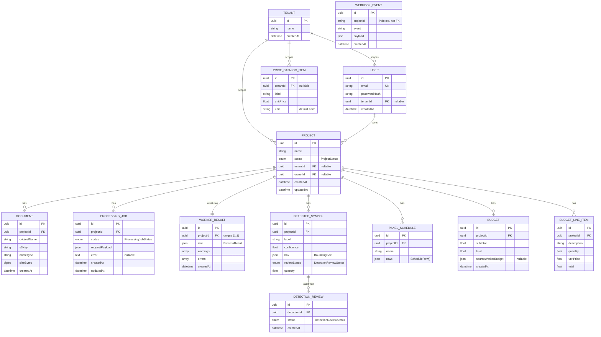
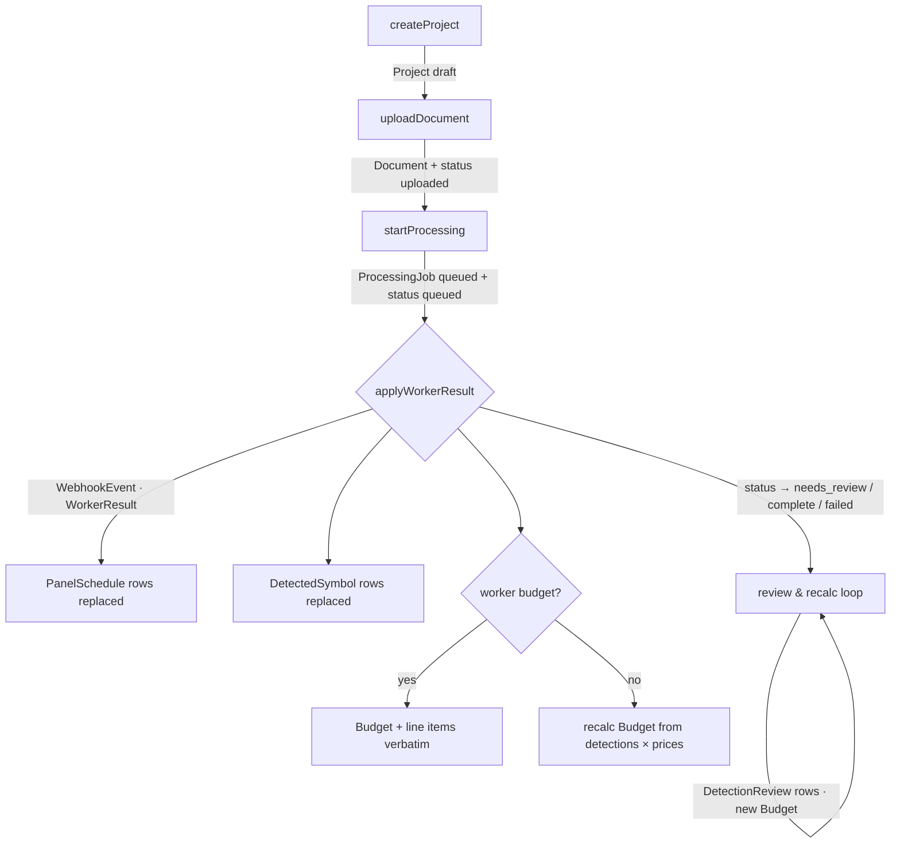

# Data Model

Every persistent entity in the orchestrator, its columns, relationships, and the
lifecycle that fills them. Entities are defined under
`apps/orchestrator/src/persistence/entities/` (one cohesive file per aggregate, with
a barrel `index.ts`).

> See [ORCHESTRATOR.md](ORCHESTRATOR.md) for the services that own these tables and
> [ARCHITECTURE.md](ARCHITECTURE.md#the-processing-lifecycle) for how a worker result
> populates them atomically.

---

## Entity-relationship diagram

> `WEBHOOK_EVENT` stores `projectId` as a plain indexed string (not a foreign key)
> and carries a **unique `(projectId, event)`** constraint — the basis of idempotent
> ingestion.

---

## Enumerations

| Enum | Values | Used by |
|---|---|---|
| `ProjectStatus` | `draft` · `uploaded` · `queued` · `processing` · `needs_review` · `complete` · `failed` | `Project.status` — transitions guarded by `ProjectStatusMachine` |
| `ProcessingJobStatus` | `queued` · `processing` · `completed` · `needs_review` · `failed` | `ProcessingJob.status` |
| `DetectionReviewStatus` | `pending` · `accepted` · `rejected` | `DetectedSymbolEntity.reviewStatus`, `DetectionReview.status` |

---

## Entity catalog

### Identity — `identity.entity.ts`

**`Tenant`** — an organization boundary (multi-tenancy foundation).

| Column | Type | Notes |
|---|---|---|
| `id` | uuid | PK |
| `name` | string | |
| `createdAt` | datetime | |

**`User`** — a login.

| Column | Type | Notes |
|---|---|---|
| `id` | uuid | PK |
| `email` | string | **unique** |
| `passwordHash` | string | bcrypt, 12 rounds |
| `tenant` | → `Tenant` | ManyToOne, nullable |
| `createdAt` | datetime | |

### Project aggregate — `project.entity.ts`

**`Project`** — the central aggregate.

| Column | Type | Notes |
|---|---|---|
| `id` | uuid | PK |
| `name` | string | |
| `status` | `ProjectStatus` | default `draft` |
| `tenant` | → `Tenant` | nullable |
| `owner` | → `User` | nullable |
| `documents` | → `Document[]` | OneToMany |
| `createdAt` / `updatedAt` | datetime | |

**`DocumentEntity`** — an uploaded PDF.

| Column | Type | Notes |
|---|---|---|
| `project` | → `Project` | ManyToOne, required |
| `originalName` | string | original filename |
| `s3Key` | string | `projects/<id>/<uuid>-<name>` |
| `mimeType` | string | always `application/pdf` |
| `sizeBytes` | bigint (string) | stored as string for portability |

**`ProcessingJob`** — one dispatch attempt.

| Column | Type | Notes |
|---|---|---|
| `project` | → `Project` | required |
| `status` | `ProcessingJobStatus` | default `queued` |
| `requestPayload` | json | the dispatched `ProcessRequest` |
| `error` | text | nullable |

**`WorkerResult`** — the raw worker output, archived verbatim.

| Column | Type | Notes |
|---|---|---|
| `project` | → `Project` | **OneToOne** (latest result per project) |
| `raw` | json | full `ProcessResult` |
| `warnings` / `errors` | string[] | `simple-array` |

### Detection aggregate — `detection.entity.ts`

**`DetectedSymbolEntity`** — a normalized, reviewable detection.

| Column | Type | Notes |
|---|---|---|
| `project` | → `Project` | required |
| `label` | string | e.g. `duplex receptacle` |
| `confidence` | float | 0–1 from the worker |
| `box` | json | `BoundingBox { page, x, y, width, height }` |
| `reviewStatus` | `DetectionReviewStatus` | default `pending` |
| `quantity` | float | default `1`; editable in review |

**`DetectionReview`** — append-only audit of accept/reject decisions.

| Column | Type | Notes |
|---|---|---|
| `detection` | → `DetectedSymbolEntity` | required |
| `status` | `DetectionReviewStatus` | the decision recorded |
| `createdAt` | datetime | |

**`PanelScheduleEntity`** — an extracted schedule table.

| Column | Type | Notes |
|---|---|---|
| `project` | → `Project` | required |
| `name` | string | schedule name |
| `rows` | json | `ScheduleRow[]` (`{ values: Record<string, string\|number\|null> }`) |

### Budget aggregate — `budget.entity.ts`

**`BudgetEntity`** — a budget snapshot.

| Column | Type | Notes |
|---|---|---|
| `project` | → `Project` | required |
| `subtotal` / `total` | float | default `0` |
| `sourceWorkerBudget` | json | nullable — set when the worker supplied a budget |

**`BudgetLineItemEntity`** — one priced row.

| Column | Type | Notes |
|---|---|---|
| `project` | → `Project` | required |
| `description` | string | the label |
| `quantity` · `unitPrice` · `total` | float | `total = round(quantity × unitPrice)` |

**`PriceCatalogItem`** — label → unit price.

| Column | Type | Notes |
|---|---|---|
| `tenant` | → `Tenant` | nullable; indexed `(tenant, label)` |
| `label` | string | must match a detection label to auto-price |
| `unitPrice` | float | |
| `unit` | string | default `each` |

### Events — `event.entity.ts`

**`WebhookEvent`** — idempotency + audit for inbound webhooks.

| Column | Type | Notes |
|---|---|---|
| `projectId` | string | indexed |
| `event` | string | e.g. `pipeline.completed` |
| `payload` | json | the received body |
| — | — | **unique `(projectId, event)`** ⇒ redelivery is a no-op |

---

## Lifecycle: how a project fills these tables

All writes inside `applyWorkerResult` and `recalculate` happen in a **single
transaction** (`TransactionRunner`), so a partial failure never leaves a project
half-ingested.

---

## Persistence notes

> ⚠️ **Portable column types.** Entities use `simple-json`, `simple-array`, and
> `simple-enum` so the same definitions boot on **SQL.js** (local, no Docker) and
> **PostgreSQL**. If production later needs native `jsonb`/enum types, introduce
> migrations carefully and keep SQL.js local mode working — see
> [NEXT_STEPS.md](NEXT_STEPS.md#2-add-typeorm-migrations).

- `synchronize` is `true` for SQL.js and for non-production Postgres; production must
  run with `synchronize: false` + migrations.
- The previously-unused `AuditLog` entity and the `DetectionReview` override columns
  were removed during the refactor (see [CODE_REVIEW.md](CODE_REVIEW.md)).
