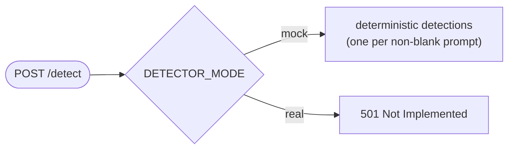

# Detector Service

`services/detector` is a small **FastAPI** service that exposes a
Grounded-SAM-compatible HTTP contract for symbol detection. In this repository it is a
**deterministic mock** — the real GPU model is intentionally not wired, so the whole
pipeline can run without a GPU or model weights.

> The worker (not the orchestrator) is the detector's client: during processing it
> renders/tiles plan images and calls `/detect` with prompts. The contract mirrors
> `DetectorRequest`/`DetectorResponse` in [CONTRACTS.md](CONTRACTS.md#detector-contract).

---

## Endpoints

| Method | Path | Purpose | Response |
|---|---|---|---|
| `GET` | `/health` | liveness | `{ "ok": true, "service": "detector" }` |
| `GET` | `/ready` | readiness + mode | `{ "ready": true, "mode": "mock" }` |
| `POST` | `/detect` | run detection | `DetectorResponse` |

### `POST /detect`

**Request — `DetectorRequest`**

| Field | Type | Rules |
|---|---|---|
| `image` | string | non-empty, base64-encoded image |
| `prompts` | string[] | text prompts (e.g. symbol names); default `[]` |

**Response — `DetectorResponse`** — `{ "detections": Detection[] }`, where each
`Detection` is `{ label, confidence (0–1), box: { page, x, y, width, height } }`.

```json
{ "detections": [
  { "label": "duplex receptacle", "confidence": 0.95,
    "box": { "page": 0, "x": 105, "y": 120, "width": 28, "height": 22 } } ] }
```

**Errors** — `400` if `image` is not valid base64 or is empty; `501` if
`DETECTOR_MODE=real` (no model wired yet).

---

## Modes



| `DETECTOR_MODE` | Behaviour |
|---|---|
| `mock` (default) | Returns one `Detection` per non-blank prompt. |
| `real` | Returns `501` until a real Grounded-SAM backend is added. |

### Mock algorithm

Deterministic and reproducible (no randomness):

- A `seed` is derived from the image byte length: `max(1, len(image_bytes) % 97)`.
- For each non-blank prompt at index *i*:
  - `label = prompt`
  - `confidence = round(max(0.55, 0.95 - i * 0.03), 2)` — slightly decreasing
  - `box = { page: 0, x: 80 + i*42 + seed, y: 120 + i*35, width: 28, height: 22 }`

So the same image + prompts always yield the same detections — ideal for tests and UI
development.

---

## Packaging

```dockerfile
FROM python:3.12-slim
WORKDIR /app
COPY requirements.txt . && pip install -r requirements.txt
COPY app.py .
EXPOSE 8010
CMD ["uvicorn", "app:app", "--host", "0.0.0.0", "--port", "8010"]
```

Dependencies (`requirements.txt`): `fastapi`, `uvicorn[standard]`, `pydantic`, plus
`pytest`/`httpx` for tests. In `docker-compose.yml` the service is built from
`./services/detector` and published on port `8010` with `DETECTOR_MODE=mock`.

---

## Tests

`services/detector/test_app.py` (pytest) covers the contract:

- `test_health` — health returns `ok: true`.
- `test_mock_detect_contract` — two prompts → two detections, first label preserved.
- `test_invalid_base64_rejected` — bad base64 → `HTTPException 400`.

Run them:

```bash
python3 -m pip install --target /tmp/auto-estimator-detector-deps -r services/detector/requirements.txt
cd services/detector
PYTHONDONTWRITEBYTECODE=1 \
PYTHONPATH=/tmp/auto-estimator-detector-deps:. \
python3 -m pytest -q -p no:cacheprovider test_app.py
```

---

## Replacing the mock

To wire a real detector, implement the `real` branch of `/detect` behind the same
contract (so nothing upstream changes): load a Grounded-SAM-compatible model, run it
against the decoded image with the prompts, and map outputs to `Detection`. See
[NEXT_STEPS.md](NEXT_STEPS.md#6-replace-detector-mock-internals) for the full
checklist (GPU image, thresholding, batching, deployment target).
