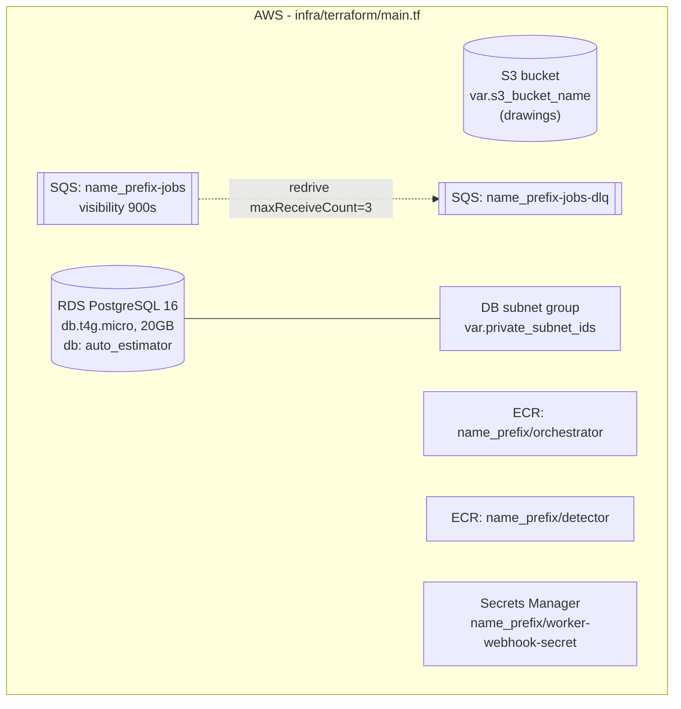
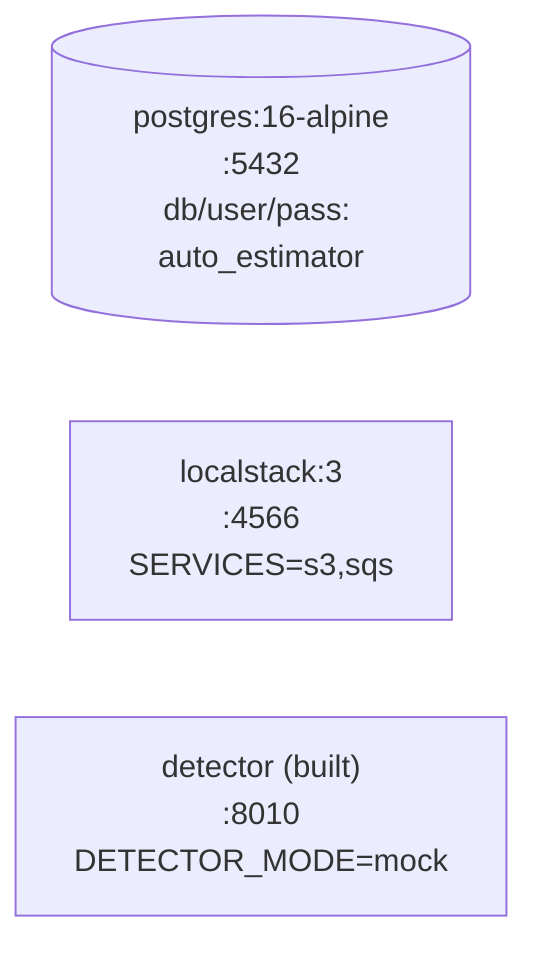

# Infrastructure

How the platform is provisioned — the AWS **skeleton** in `infra/terraform` and the
local container stack in `docker-compose.yml`.

> ⚠️ The Terraform here is a **skeleton**, not a complete deployment. It declares the
> core resources but not networking, compute (ECS), IAM, or observability. The
> remaining work is tracked in [NEXT_STEPS.md](NEXT_STEPS.md#7-production-infrastructure).

---

## AWS resources (Terraform)



| Resource | Terraform name | Notes |
|---|---|---|
| S3 bucket | `aws_s3_bucket.drawings` | uploaded PDFs (`var.s3_bucket_name`) |
| SQS queue | `aws_sqs_queue.jobs` | processing jobs; 900s visibility timeout |
| SQS DLQ | `aws_sqs_queue.jobs_dlq` | dead-letter after 3 receives |
| RDS | `aws_db_instance.postgres` | PostgreSQL 16, `db.t4g.micro`, 20 GB, not public |
| DB subnet group | `aws_db_subnet_group.main` | from `var.private_subnet_ids` |
| ECR (orchestrator) | `aws_ecr_repository.orchestrator` | container image registry |
| ECR (detector) | `aws_ecr_repository.detector` | container image registry |
| Secret | `aws_secretsmanager_secret.worker_webhook_secret` | shared HMAC secret |

### Variables (`variables.tf`)

| Variable | Type | Default | Notes |
|---|---|---|---|
| `name_prefix` | string | `auto-estimator` | prefix for named resources |
| `aws_region` | string | `us-east-1` | provider region |
| `s3_bucket_name` | string | — | **required** |
| `private_subnet_ids` | list(string) | `[]` | for the DB subnet group |
| `db_security_group_ids` | list(string) | `[]` | attached to RDS |
| `db_instance_class` | string | `db.t4g.micro` | |
| `db_username` | string | `auto_estimator` | |
| `db_password` | string | — | **required**, `sensitive` |

### Outputs

| Output | Value |
|---|---|
| `s3_bucket` | the drawings bucket name |
| `sqs_queue_url` | the jobs queue URL (→ `SQS_QUEUE_URL`) |
| `orchestrator_repository_url` | ECR repo URL for the orchestrator image |

### Commands

```bash
cd infra/terraform
terraform fmt -check
terraform init -backend=false
terraform validate
```

---

## Local containers (Docker Compose)

`docker-compose.yml` brings up the production-like dependencies locally.



| Service | Image / build | Port | Purpose |
|---|---|---|---|
| `postgres` | `postgres:16-alpine` | 5432 | `DB_TYPE=postgres` target |
| `localstack` | `localstack/localstack:3` | 4566 | S3 + SQS for `STORAGE_MODE=s3` / `WORKER_MODE=sqs` |
| `detector` | built from `services/detector` | 8010 | mock detector |

```bash
cp .env.example .env
docker compose up -d postgres localstack detector
```

> 🧪 Docker is not available in the current WSL environment, so the **no-Docker**
> mode (SQL.js + local storage + mock worker) is the proven local path. When Docker
> is available, point the orchestrator at these services via the matching env vars in
> [CONFIGURATION.md](CONFIGURATION.md). LocalStack bootstrap scripts (auto-creating the
> bucket/queue) are still to be written.

---

## Mapping infrastructure → configuration

| Resource | Drives env var | Mode |
|---|---|---|
| S3 bucket | `S3_BUCKET` (+ `S3_ENDPOINT` for LocalStack) | `STORAGE_MODE=s3` |
| SQS queue | `SQS_QUEUE_URL` (+ `SQS_ENDPOINT`) | `WORKER_MODE=sqs` |
| RDS | `DATABASE_URL` | `DB_TYPE=postgres` |
| Secret | `WORKER_WEBHOOK_SECRET` | webhook HMAC |

---

## Gaps before production

From [NEXT_STEPS.md](NEXT_STEPS.md#7-production-infrastructure): VPC/subnets/security
groups, an ECS service for the orchestrator, a web deployment target, RDS
backups/parameters, IAM policies for S3/SQS/Secrets, CloudWatch dashboards/alarms, a
remote Terraform backend, and per-environment tfvars.
