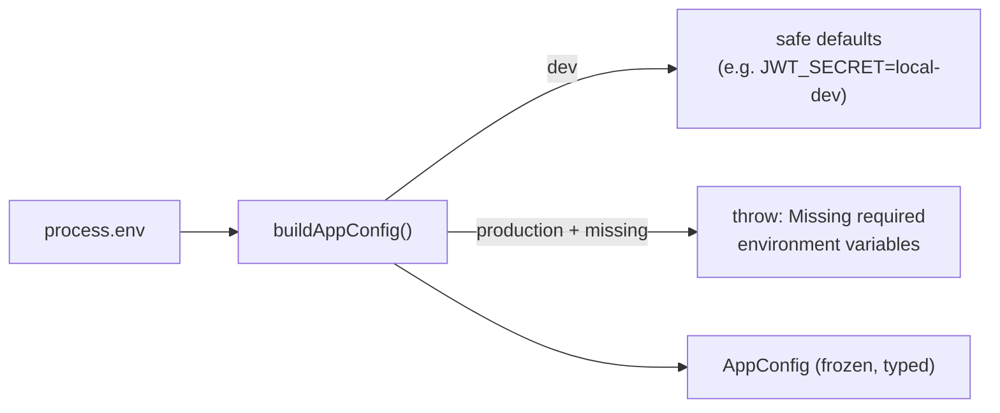
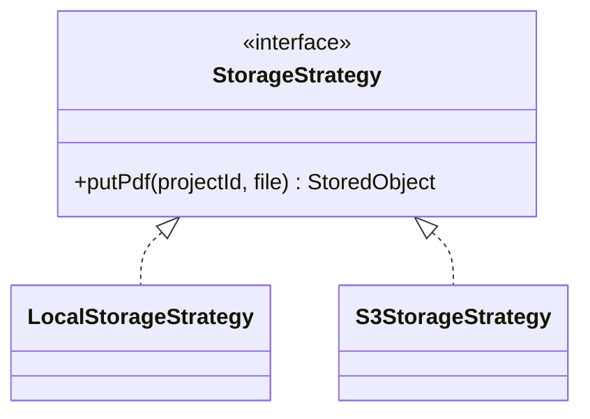
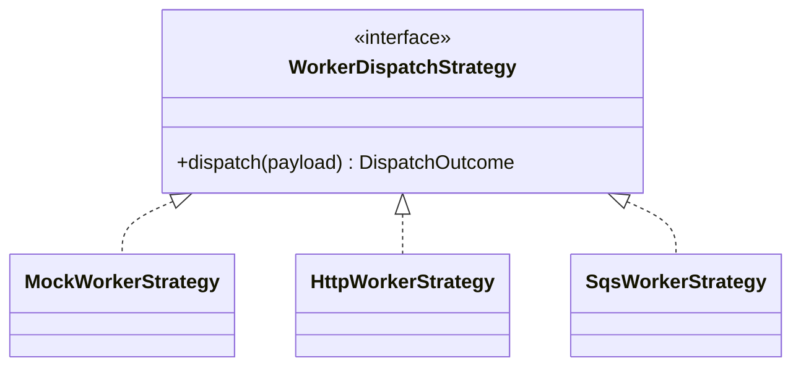

# Orchestrator Reference

The orchestrator (`apps/orchestrator`) is the heart of the platform: a NestJS API
that owns every domain entity, stores uploaded PDFs, dispatches processing jobs,
ingests worker results, and serves the web app.

> This page is the module-by-module reference. For the big picture and diagrams see
> [ARCHITECTURE.md](ARCHITECTURE.md); for entities see [DATA_MODEL.md](DATA_MODEL.md);
> for endpoints see [API_REFERENCE.md](API_REFERENCE.md).

---

## Contents

- [Directory map](#directory-map)
- [Bootstrap](#bootstrap)
- [Configuration](#configuration)
- [Common helpers](#common)
- [Persistence](#persistence)
- [Storage strategy](#storage)
- [Worker dispatch strategy](#worker-dispatch)
- [Feature modules](#feature-modules)
  - [Auth](#auth) · [Projects](#projects) · [Documents](#documents) · [Detections](#detections) · [Budget](#budget) · [Pricing](#pricing) · [Processing](#processing) · [Health](#health)
- [Conventions](#conventions)

---

## Directory map

```text
apps/orchestrator/src/
├── main.ts                      # Nest bootstrap: CORS, /api prefix, port
├── app.module.ts                # Composition root — imports every module
│
├── config/                      # Typed, validated configuration
│   ├── app-config.ts            #   AppConfig interface + APP_CONFIG token
│   ├── configuration.ts         #   buildAppConfig(): read env, default, fail-fast
│   ├── config.module.ts         #   @Global module providing APP_CONFIG
│   └── configuration.spec.ts
│
├── common/                      # Cross-cutting helpers (global module)
│   ├── common.module.ts
│   ├── transaction.runner.ts    #   TransactionRunner.run(manager ⇒ …)
│   ├── validation.ts            #   requireString / parseBoundingBox / …
│   ├── money.ts                 #   roundMoney()
│   └── *.spec.ts
│
├── persistence/                 # Data layer
│   ├── database.module.ts       #   TypeOrmModule.forRootAsync(APP_CONFIG)
│   ├── persistence.module.ts    #   forFeature(entities) + re-export
│   └── entities/                #   one cohesive file per aggregate + barrel
│
├── storage/                     # StorageStrategy: local | s3 (factory)
├── worker/                      # WorkerDispatchStrategy: mock | http | sqs
│
├── auth/         projects/      detections/    budget/
├── documents/    pricing/       processing/    health/
```

The old flat `src/projects.service.ts`, `src/storage.service.ts`, etc. shim files
have been removed. New code imports from the module folders.

---

## Bootstrap

`main.ts` creates the Nest app with `rawBody: true` (needed for HMAC webhook
verification), reads the typed config, applies CORS and the global `/api` prefix,
and listens.

```ts
const app = await NestFactory.create(AppModule, { rawBody: true });
const config = app.get<AppConfig>(APP_CONFIG);
app.enableCors({ origin: config.webOrigins, credentials: true });
app.setGlobalPrefix("api");
await app.listen(config.port);
```

`app.module.ts` is the composition root. Global modules (`AppConfigModule`,
`CommonModule`) and the database connection are imported once; feature modules pull
in what they need. See the [module graph](ARCHITECTURE.md#orchestrator-module-graph).

---

## Configuration

<a id="configuration"></a>

`process.env` is read in **one** place and never again. `buildAppConfig()` applies
clearly-marked development defaults and throws in production when a required secret
is missing.



`AppConfig` groups settings into `jwt`, `auth`, `database`, `storage`, `worker`, and
`webhook`. Consumers inject it by token:

```ts
constructor(@Inject(APP_CONFIG) private readonly config: AppConfig) {}
```

Full variable reference: [CONFIGURATION.md](CONFIGURATION.md).

---

## Common

<a id="common"></a>

| File | Export | Purpose |
|---|---|---|
| `transaction.runner.ts` | `TransactionRunner` | `run<T>(work: (manager) => Promise<T>)` wraps a TypeORM transaction so services express "do these writes atomically." |
| `validation.ts` | `requireString`, `optionalString`, `optionalNumber`, `requireNonNegativeNumber`, `parseBoundingBox` | Hand-rolled request-body validators that throw `BadRequestException`. |
| `money.ts` | `roundMoney(n)` | Rounds to 2 decimals — the single rounding rule for all currency math. |

> 💡 Validation is hand-rolled because `zod` is only a transitive dependency of the
> orchestrator. Adding `zod` directly would let these be replaced by a shared
> `ZodValidationPipe` driven by `packages/contracts`. See
> [CODE_REVIEW.md](CODE_REVIEW.md#implementation-notes--deviations).

---

## Persistence

- **`DatabaseModule`** configures the connection with `TypeOrmModule.forRootAsync`,
  reading `APP_CONFIG` to choose `sqljs` (local) or `postgres` (production) and to
  set `synchronize` (never `true` in production).
- **`PersistenceModule`** registers every entity with `forFeature(entities)` and
  re-exports `TypeOrmModule`, so any feature module that imports it can inject the
  repositories it needs.

Entities live one-aggregate-per-file under `persistence/entities/` with a barrel
`index.ts` that also exports the `entities` array. Full schema:
[DATA_MODEL.md](DATA_MODEL.md).

---

## Storage

<a id="storage"></a>

PDF persistence is an interface with two implementations, selected by a factory from
config — adding a backend never touches `DocumentsService`.



| Token | Implementations | Selected when |
|---|---|---|
| `STORAGE` | `LocalStorageStrategy` (writes under `LOCAL_STORAGE_DIR`) | `STORAGE_MODE=local` |
| | `S3StorageStrategy` (S3 / S3-compatible) | `STORAGE_MODE=s3` (default) |

Both return `{ bucket, key }`; the key is `projects/<projectId>/<uuid>-<filename>`.

---

## Worker dispatch

<a id="worker-dispatch"></a>

How a `ProcessRequest` reaches the AI worker. Each strategy returns a
`DispatchOutcome { mode, result? }`; `result` is present **only** for the mock
(synchronous) path. Real workers reply later via the webhook.



| Token | Implementation | Behaviour |
|---|---|---|
| `WORKER_DISPATCH` | `MockWorkerStrategy` | Returns `{ mode:"mock", result: buildMockResult() }` — the fixture lives in `worker/mock-result.ts`, so no mock logic leaks into the domain. |
| | `HttpWorkerStrategy` | `POST`s to `WORKER_HTTP_URL`; throws `ServiceUnavailableException` on non-2xx. |
| | `SqsWorkerStrategy` | Sends the JSON to `SQS_QUEUE_URL` (validated at construction). |

> 💡 `ProcessingService` never inspects the mode — it simply applies
> `outcome.result` if present. This is what keeps the mock out of the domain.

---

## Feature modules

### Auth

<a id="auth"></a>

`auth/` — registration, login, JWT issuance, and the guard infrastructure.

| Symbol | Role |
|---|---|
| `AuthService` | `register` (bcrypt hash, creates a default tenant), `login` (verify + issue), `issueToken`. |
| `AuthController` | `POST /auth/register`, `POST /auth/login`, `GET /me` (guarded). |
| `JwtAuthGuard` | Verifies the Bearer token and attaches `AuthUser` to the request. |
| `@CurrentUser()` | Param decorator returning the attached `AuthUser`. |

> ⚠️ **Enforcement is opt-in.** The guard exists and protects `GET /me`, but project
> routes are intentionally unguarded until tenant scoping and a web login screen land
> (`AUTH_ENFORCE` flag + [NEXT_STEPS.md](NEXT_STEPS.md#1-finish-auth-and-tenant-scoping)).

### Projects

<a id="projects"></a>

`projects/` — project CRUD, document upload coordination, and the **state machine**.

| Symbol | Role |
|---|---|
| `ProjectsService` | `createProject`, `listProjects`, `getProject`, `uploadDocument`, `transitionTo`. |
| `ProjectStatusMachine` | `canTransition(from,to)` / `assert(from,to)` — the single definition of legal `ProjectStatus` moves (see the [state diagram](ARCHITECTURE.md#project-status-state-machine)). |
| `ProjectsController` | `POST /projects`, `GET /projects`, `GET /projects/:id`, `POST /projects/:id/upload`. |

`uploadDocument` delegates storage to `DocumentsService`, then advances status via the
machine — never by direct assignment.

### Documents

<a id="documents"></a>

`documents/` — owns `DocumentEntity` and uses the injected `StorageStrategy`.

| Symbol | Role |
|---|---|
| `DocumentsService.store(project, file)` | Validates the PDF mimetype, persists bytes via `STORAGE`, records a `DocumentEntity`. |
| `DocumentsService.findLatest(projectId)` | Returns the most recent upload — used by processing. |

### Detections

<a id="detections"></a>

`detections/` — the human review surface's backend.

| Symbol | Role |
|---|---|
| `DetectionsService.listForProject(id)` | Ordered list for review. |
| `updateDetection(id, detectionId, input)` | Edit label / quantity / box (validated via `parseUpdateDetection`). |
| `setStatus(id, detectionId, status)` | Accept/reject; also appends a `DetectionReview` audit row. |
| `replaceForProject(manager, project, symbols)` | Transaction-aware bulk replace used during ingestion. |
| `DetectionsController` | `GET …/detections`, `PATCH …/:detectionId`, `POST …/:detectionId/{accept,reject}`. |

### Budget

<a id="budget"></a>

`budget/` — turns reviewed detections into priced line items, and exports.

| Symbol | Role |
|---|---|
| `BudgetService.getBudget(id)` | Latest budget + line items. |
| `recalculate(id)` | Public endpoint: load project + price map, then run `recalculateWithin` in a transaction. |
| `recalculateWithin(manager, project, priceMap)` | Aggregates **non-rejected** detections by label, prices each (missing price ⇒ 0), replaces the stored budget. |
| `persistWorkerBudgetWithin(manager, project, budget)` | Stores a worker-provided budget verbatim. |
| `ExportService.exportCsv(id)` | CSV of line items (JSON export is served by processing's `getResult`). |
| `BudgetController` | `GET …/budget`, `POST …/budget/recalculate`, `GET …/export.csv`. |

> 💡 Budget math uses `roundMoney` everywhere. Rejected detections are excluded;
> quantities are summed per label.

### Pricing

<a id="pricing"></a>

`pricing/` — the price catalog that maps a detection label to a unit price.

| Symbol | Role |
|---|---|
| `PricingService.listPrices()` | All catalog items, ordered by label. |
| `upsertPrice({label, unitPrice, unit?})` | Insert or update (validated). |
| `getPriceMap()` | `label → unitPrice` map for budget recalculation. |
| `PricingController` | `GET /price-catalog`, `POST /price-catalog`. |

### Processing

<a id="processing"></a>

`processing/` — the **application service** that orchestrates the others.

| Symbol | Role |
|---|---|
| `ProcessingService.startProcessing(id)` | Build + validate `ProcessRequest`, record a `ProcessingJob`, move to `queued`, dispatch, and apply a synchronous result if returned. |
| `applyWorkerResult(input)` | Validate, dedupe via `WebhookEvent`, then in **one transaction** persist raw result, schedules, detections, budget, and updated statuses. |
| `getStatus(id)` / `getResult(id)` / `exportJson(id)` | Read aggregations across projects, detections, schedules, budget. |
| `ProcessingController` | `POST …/process`, `GET …/status`, `GET …/result`, `GET …/export.json`. |
| `WebhookController` | `POST /worker/webhooks/pipeline-completed` — event + HMAC check, then `applyWorkerResult`. |

See the [ingestion sequence](ARCHITECTURE.md#the-processing-lifecycle) for the full flow.

### Health

<a id="health"></a>

`health/` — `GET /health` → `{ ok: true, service: "orchestrator" }`. Liveness probe.

---

## Conventions

- **Files**: `*.controller.ts` (HTTP edge), `*.service.ts` (logic), `*.module.ts`
  (wiring), `*.strategy.ts` (interchangeable infra), `*.entity.ts` (persistence),
  `*.spec.ts` (tests).
- **DI**: constructor injection only; infrastructure injected by token
  (`APP_CONFIG`, `STORAGE`, `WORKER_DISPATCH`).
- **Errors**: throw NestJS HTTP exceptions; never a bare `Error` in a request path.
- **Persistence boundary**: only services touch repositories. Controllers and
  cross-domain code depend on services.
- **Tests**: `pnpm --filter @auto-estimator/orchestrator test` (Jest + ts-jest).
  Current specs cover config, validation, money, and the status machine; service
  integration tests against in-memory SQL.js are a follow-up.
