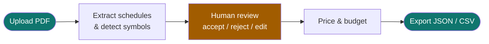
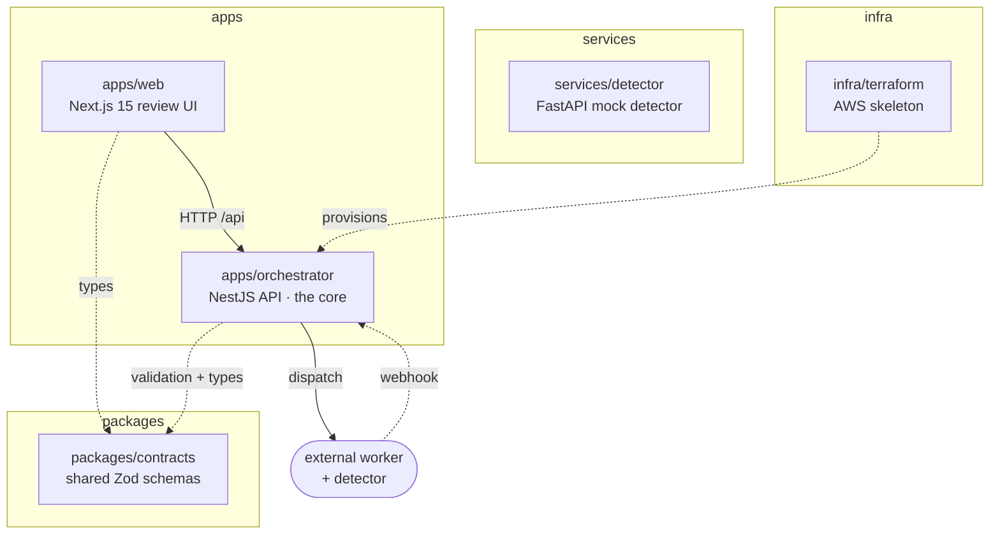
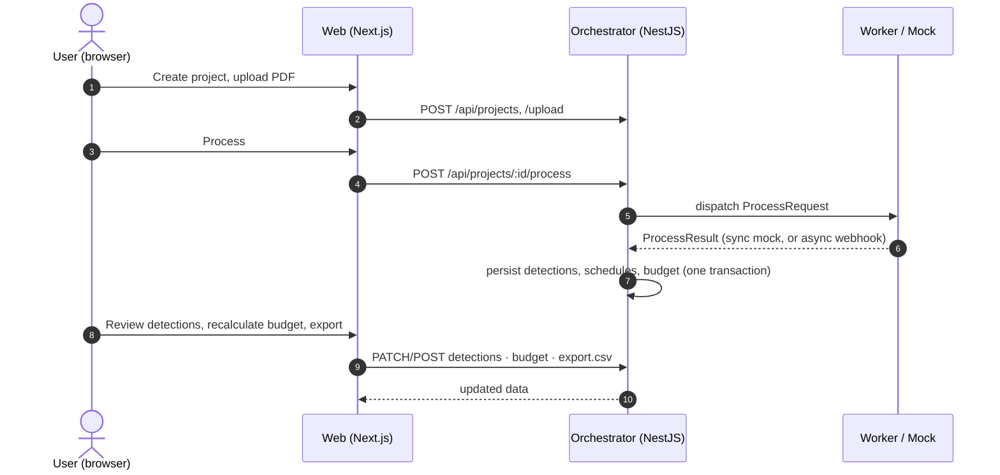

# Auto Estimator Platform — Documentation

> Turn large electrical‑drawing PDFs into a **reviewed, priced electrical estimate**.

This is the documentation home for the Auto Estimator Platform. Start here, then
follow the map to the area you care about. Every document is kept in sync with the
code under `apps/`, `packages/`, `services/`, and `infra/`.

---

## What is this platform?

A contractor uploads a set of electrical drawings (a PDF). An AI worker extracts the
**panel schedules** and detects **electrical symbols** (receptacles, luminaires, …).
A human then reviews and corrects those detections in a web UI, the platform prices
them against a **price catalog**, and the result is exported as JSON or CSV.

The AI pipeline itself lives in a separate **worker** repository
(`/home/jerov/workspace/construction`). **This** repository is the *product and
infrastructure shell* around it: the API, the review UI, a mock detector, shared
contracts, and the cloud skeleton. It runs end‑to‑end locally with **mocked** AI so
the whole product flow works without Docker, cloud credentials, or a GPU.

---

## The pieces at a glance

| Package | Path | What it is | Reference |
|---|---|---|---|
| Orchestrator | `apps/orchestrator` | NestJS API — owns all data, dispatch, ingestion, exports | [ORCHESTRATOR.md](ORCHESTRATOR.md) |
| Web | `apps/web` | Next.js 15 / React 19 operational UI | [WEB.md](WEB.md) |
| Contracts | `packages/contracts` | Zod schemas shared by web + orchestrator + worker | [CONTRACTS.md](CONTRACTS.md) |
| Detector | `services/detector` | FastAPI Grounded‑SAM‑shaped mock service | [DETECTOR.md](DETECTOR.md) |
| Infrastructure | `infra/terraform`, `docker-compose.yml` | AWS skeleton + local containers | [INFRASTRUCTURE.md](INFRASTRUCTURE.md) |

---

## Documentation map

### Start here
- **[PROJECT_CONTEXT.md](PROJECT_CONTEXT.md)** — why the platform exists, the PDF reality, what is real vs. mocked.
- **[ARCHITECTURE.md](ARCHITECTURE.md)** — the big picture: components, module graph, request & processing lifecycles, run modes, deployment topology. *Most diagrams live here.*

### Build & run
- **[LOCAL_DEVELOPMENT.md](LOCAL_DEVELOPMENT.md)** — install, build, run no‑Docker, smoke‑test the full flow.
- **[CONFIGURATION.md](CONFIGURATION.md)** — every environment variable, the typed config model, run‑mode matrices, and production fail‑fast rules.

### Reference
- **[ORCHESTRATOR.md](ORCHESTRATOR.md)** — backend module-by-module: services, controllers, strategies, transactions, state machine.
- **[WEB.md](WEB.md)** — frontend: routes, API client, the `useAsyncData` hook, component catalog, the review surface.
- **[DATA_MODEL.md](DATA_MODEL.md)** — entities, the ER diagram, enums, and lifecycle.
- **[API_REFERENCE.md](API_REFERENCE.md)** — every HTTP endpoint with request/response shapes and `curl` examples.
- **[CONTRACTS.md](CONTRACTS.md)** — worker request/result, detector, and webhook contracts.
- **[DETECTOR.md](DETECTOR.md)** — the FastAPI detector service.
- **[INFRASTRUCTURE.md](INFRASTRUCTURE.md)** — Terraform resources and Docker Compose.
- **[GLOSSARY.md](GLOSSARY.md)** — domain vocabulary.

### Quality & roadmap
- **[CODE_REVIEW.md](CODE_REVIEW.md)** — findings from the architectural review and the refactor that addressed them.
- **[NEXT_STEPS.md](NEXT_STEPS.md)** — remaining workstreams toward production.

---

## A 60‑second tour of the request flow

---

## Conventions used in these docs

- **Diagrams** are [Mermaid](https://mermaid.js.org/) and render natively on GitHub.
- **Paths** are relative to the repository root unless noted.
- **`code font`** marks files, identifiers, env vars, and commands.
- Callouts:
  - 💡 *Tip* — a helpful shortcut.
  - ⚠️ *Important* — a correctness or safety constraint.
  - 🧪 *Local‑only* — applies to the no‑Docker development mode.

> ⚠️ **Source of truth.** The AI worker in `/home/jerov/workspace/construction` owns
> PDF ingestion and detection. Never change the shared field names
> (`project_id`, `s3_key`, `callback_url`, `unit_prices`) without updating
> `packages/contracts` and the worker together.
