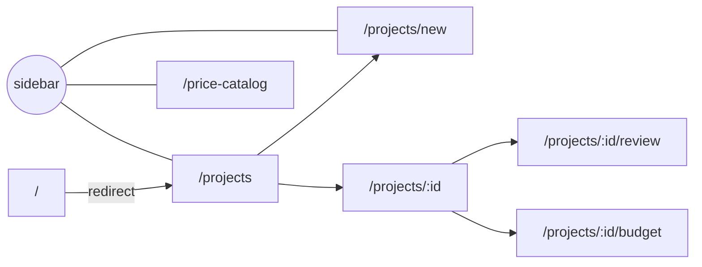
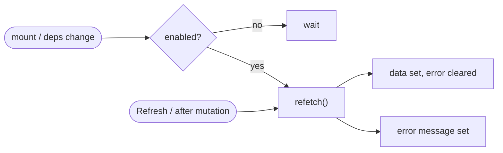

# Web App Reference

The web app (`apps/web`) is the operational review UI: a Next.js 15 / React 19
App Router application. It is intentionally dense and workflow-first — **not** a
marketing site.

> The UI talks only to the orchestrator's REST API ([API_REFERENCE.md](API_REFERENCE.md)).
> It holds no business logic beyond presentation and local edit state.

---

## Contents

- [Stack & rendering model](#stack--rendering-model)
- [Route map](#route-map)
- [The data layer](#the-data-layer)
- [Component catalog](#component-catalog)
- [Page reference](#page-reference)
- [The review surface](#the-review-surface)
- [Styling](#styling)
- [Build & run](#build--run)

---

## Stack & rendering model

| Aspect | Choice |
|---|---|
| Framework | Next.js 15 (App Router, `app/`) |
| UI | React 19, function components + hooks |
| Icons | `lucide-react` |
| Rendering | Pages are **client components** (`"use client"`) — interactive, fetch on mount |
| Types | Shared from `@auto-estimator/contracts` where applicable (e.g. `BoundingBox`) |

Dynamic routes receive `params` as a **promise** (Next 15). The `useProjectId` hook
unwraps it.

```text
apps/web/app/
├── layout.tsx              # <html> shell + global styles
├── page.tsx                # redirects → /projects
├── styles.css              # design tokens + layout
├── components.tsx          # shared UI: AppShell, Toolbar, ErrorPanel, Badge, RefreshButton
├── api.ts                  # back-compat re-export of lib/api-client
├── lib/
│   ├── api-client.ts       # typed REST client (single fetch core)
│   ├── types.ts            # view models (Project, Detection, BudgetResponse, …)
│   ├── use-async-data.ts   # generic data-fetch hook (data/error/loading/refetch)
│   └── use-project-id.ts   # unwraps the async route param
├── projects/
│   ├── page.tsx            # project list
│   ├── new/page.tsx        # create + upload
│   └── [id]/
│       ├── page.tsx        # project detail + process
│       ├── review/page.tsx # detection review surface
│       └── budget/page.tsx # budget + CSV export
└── price-catalog/page.tsx  # price catalog
```

---

## Route map



| Route | File | Purpose |
|---|---|---|
| `/` | `page.tsx` | redirect to `/projects` |
| `/projects` | `projects/page.tsx` | list projects |
| `/projects/new` | `projects/new/page.tsx` | create a project + upload a PDF |
| `/projects/:id` | `projects/[id]/page.tsx` | detail, status, **Process** |
| `/projects/:id/review` | `projects/[id]/review/page.tsx` | review detections |
| `/projects/:id/budget` | `projects/[id]/budget/page.tsx` | budget table + CSV export |
| `/price-catalog` | `price-catalog/page.tsx` | manage unit prices |

---

## The data layer

The refactor replaced six copies of a hand-rolled `load()/try/catch/useEffect` block
with a small, typed layer.

### `lib/api-client.ts`

A single private `request<T>()` fetch core (JSON in/out, throws the server message on
failure) plus one typed method per endpoint:

```ts
api.listProjects()                 // GET  /projects
api.createProject(name)            // POST /projects
api.uploadPdf(projectId, file)     // POST /projects/:id/upload (multipart)
api.process(id)                    // POST /projects/:id/process
api.getStatus(id) / api.getProject(id)
api.listDetections(id)
api.updateDetection(id, did, body) // PATCH …
api.setDetectionStatus(id, did, "accept" | "reject")
api.getBudget(id) / api.recalculateBudget(id)
api.exportCsvUrl(id)               // builds the download href
api.listPrices() / api.upsertPrice(body)
```

`API_URL` comes from `NEXT_PUBLIC_API_URL` (default `http://localhost:4000/api`).

### `lib/use-async-data.ts`

```ts
const { data, error, loading, refetch } = useAsyncData(fetcher, deps, { enabled });
```

Owns the full fetch lifecycle: sets `loading`, captures the error message, and exposes
`refetch`. `enabled` defers fetching until a dependency (such as the async route id)
is ready.



### `lib/types.ts`

View models for API responses — `Project`, `ProjectStatusResponse`, `Detection`,
`BudgetResponse`, `PriceItem` — reusing `BoundingBox` from the contracts package so
the box shape can never drift from the backend.

---

## Component catalog

`components.tsx` exports the shared, presentational building blocks:

| Component | Role |
|---|---|
| `AppShell` | sidebar (brand + nav) + main content grid |
| `Toolbar` | page header: `title`, optional `subtitle`, right-aligned action row |
| `ErrorPanel` | renders an error banner, or nothing when `message` is null |
| `Badge` | pill for statuses |
| `RefreshButton` | standard refresh action wired to `refetch` |

---

## Page reference

| Page | Reads | Writes |
|---|---|---|
| **Projects** | `api.listProjects()` | — |
| **New project** | — | `api.createProject` → `api.uploadPdf` → redirect to detail |
| **Detail** | `api.getProject` + `api.getStatus` (parallel) | `api.process` |
| **Review** | `api.listDetections` (seeds a local editable copy) | `api.updateDetection`, `api.setDetectionStatus` |
| **Budget** | `api.getBudget` | `api.recalculateBudget`; CSV via `api.exportCsvUrl` |
| **Price catalog** | `api.listPrices` | `api.upsertPrice` |

> The **Review** page keeps a local copy of the detection rows so labels/quantities
> can be edited inline before **Save**; `refetch` re-syncs after any mutation.

---

## The review surface

Detections render as absolutely-positioned boxes over a fixed-aspect "plan surface".
Worker bounding boxes are in logical units; the page maps them to CSS percentages.

```text
SURFACE_WIDTH_UNITS  = 3456   →  X_SCALE = 3456 / 100 = 34.56
SURFACE_HEIGHT_UNITS = 2592   →  Y_SCALE = 2592 / 100 = 25.92

left   = max(0, box.x      / X_SCALE) %
top    = max(0, box.y      / Y_SCALE) %
width  = max(1, box.width  / X_SCALE) %
height = max(1, box.height / Y_SCALE) %
```

Only page-0 detections are drawn on the surface; all detections appear in the
editable table beside it. Rejected boxes render in the danger color.

> 🚧 The surface is a placeholder — the real PDF page is **not** yet rendered beneath
> the boxes. A PDF.js-backed surface with zoom/pan and box drag is a roadmap item
> ([NEXT_STEPS.md](NEXT_STEPS.md#3-improve-frontend-pdf-review)).

---

## Styling

`styles.css` defines design tokens as CSS custom properties and a small set of layout
classes used across pages.

| Token | Value | Use |
|---|---|---|
| `--bg` | `#f6f7f9` | app background |
| `--panel` | `#ffffff` | cards & panels |
| `--accent` | `#0f766e` | primary actions, boxes |
| `--danger` | `#b42318` | reject / destructive |
| `--muted` | `#687384` | secondary text |

Key classes: `.shell` (sidebar + main grid), `.toolbar`, `.panel`, `.card`,
`.btn[.secondary|.danger]`, `.table`, `.review-layout`, `.plan-surface`, `.box[.rejected]`,
`.badge`. The layout collapses to a single column under 900px.

---

## Build & run

```bash
# build the whole monorepo first (contracts → orchestrator → web)
COREPACK_HOME=/tmp/corepack corepack pnpm -r build

# run the web app against a running API
NEXT_PUBLIC_API_URL=http://localhost:4000/api \
COREPACK_HOME=/tmp/corepack \
corepack pnpm --filter @auto-estimator/web start
# → http://localhost:3000/projects
```

> ⚠️ `NEXT_PUBLIC_API_URL` is **baked into the client bundle at build time**. If it
> changes, rebuild before `next start`. The known-good path in this environment is
> `next build` + `next start` (not `next dev`). See
> [LOCAL_DEVELOPMENT.md](LOCAL_DEVELOPMENT.md).
